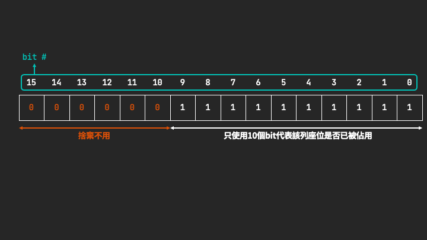
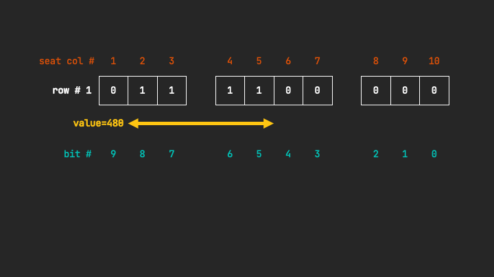
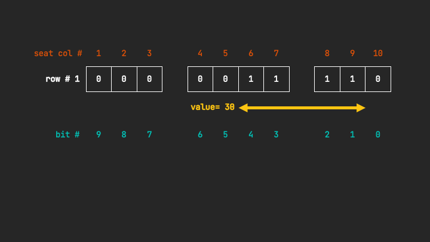
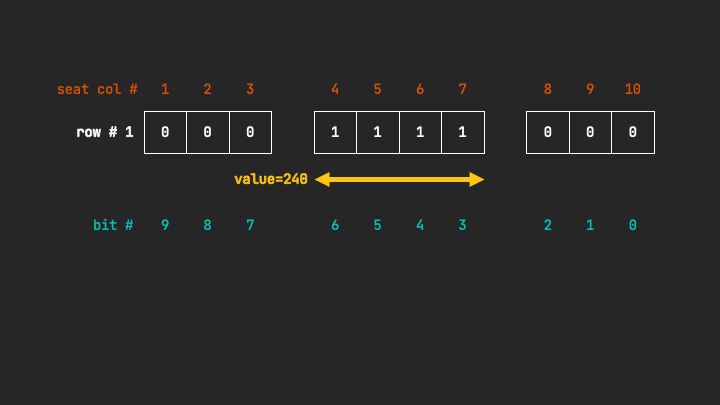

# 1386 - Cinema Seat Allocation

## 問題

- https://leetcode.com/problems/cinema-seat-allocation/

### 說明

- 每一列 (row)都有10個位置。
- 走道在3~4行之間、7~8行之間。
- 將4人座位安排必須分派在一起、不分拆，也不跨列分派、也不可有人單獨分派在走道另一邊。
    - 例外：四人座位分別兩兩對稱分派在走道兩側。

## 解法

- 採用Bitmap作法，將每個座位視為獨立的，一個座位用一個bit表示，1代表有座位、0代表無座位，一列有10個座位即代表需要10bit代表該列座位狀態。
- 使用short代表一列座位的狀態，捨棄前6個bit，只使用後面10個bit，如下圖：<br>
- LeetCode範例中的例子以Bitmap表示如下：<br>
- 題目固定為4人派位，因此採用事先設計好Pattern，以Pattern搜尋每一列可一起安排4人的連續座位，Pattern示意如下：
    - 橫跨左側走道<br>
    - 橫跨右側走道<br>
    - 中排座位<br>
- 每一列的座位狀態與Pattern作`&`計算，運算結果與Pattern的數值相同則視為有連續做有可派位。
  - 範例
    - 假設某一列的座位狀態為如下：
      ```text
       左   中   右
      100 1111 011
      ```
    - 將座位狀態與中排空位Pattern作&運算：
      ```text
      Availability = 100 1111 011 -> 635
           Pattern = 000 1111 000 -> 120
      ----------------------------------
          & Result = 000 1111 000 -> 120
      ```
- 檢查方式可由右至左依序檢查，若有可連續派位的四個位置，該四個連續座位在下一個Pattern比對檢查時會視為已被佔位，避免被認為可再派位。
  - 範例
    1. 若某列全部都有空位，則該列座位狀態為 `111 1111 111`
    2. 用Pattern ` 30` (`000 0011 1100`)檢查，發現右側走道兩側座位可派位，暫存該列座位狀態為 `111 1100 001`
    3. 用Pattern `120` (`000 1111 0000`)檢查，發現中排右邊兩個已被派位，所以代表中排無法派位，該列座位狀態仍為 `111 1100 001`
    4. 用Pattern `480` (`011 1100 0000`)檢查，發現左側走道兩側座位可派為，該列座位狀態更新為 `100 0000 001`
    